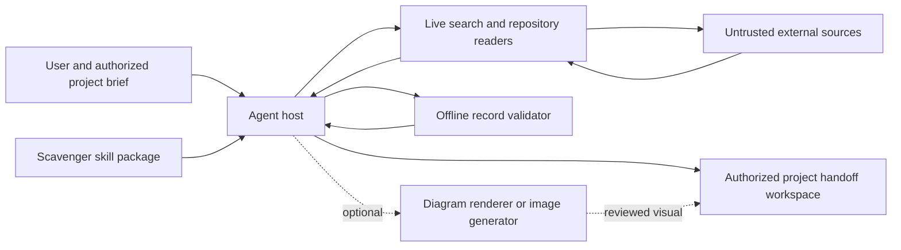
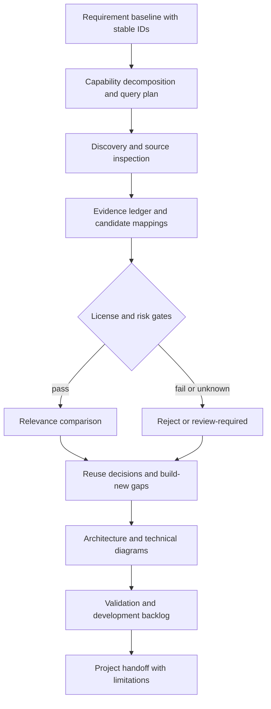

# Scavenger architecture

Scavenger is a skill executed by an existing agent host, not a new model runtime. The Mermaid blocks below are editable technical source. No generated architecture image or renderer verification is claimed for this release candidate.

## System context

## Research and decision flow

## Contracts and boundaries

The agent controls intake, tool use, claim interpretation, search breadth, and synthesis. The skill supplies instructions, references, templates, and a deterministic record helper. Sources are untrusted input, not executable instructions. The runtime helpers read local JSON; they perform no network requests and invoke no third-party commands.

A run connects requirement IDs to candidate IDs, evidence source IDs, decisions, architecture components, and implementation tasks. The JSON helper validates through the requirement/decision layer. Architecture contracts, rendered diagram consistency, evidence truth, and actual license/security review remain agent/reviewer responsibilities.

The project output workspace is separate from the reusable skill. Credentials remain in the host's authorized tool layer. Repository writes and publication are explicit operations, not effects of reading source files. Image generation is optional: technical diagram source stays authoritative and image labels/edges require review.

## Hardened helper and release boundaries

`scripts/guardrails.py` bounds and validates untrusted records, validates ledger URL syntax, and protects normal workspace creation. `scripts/scavenger.py` implements the declared evidence contract and gate-aware scoring. Neither is a network client, code executor, sandbox, or truth verifier.

The developer tools are separate: `simulate.py` exercises synthetic records; `build_release.py` creates and verifies an allowlisted ZIP; `release_check.py` applies a limited repository policy lint and executes only its own freshly built package in a temporary workspace. GitHub Actions runs tests and a separately pinned CodeQL analysis. That CI environment is not part of the installed skill's runtime.

## Design decisions

Use a portable SKILL.md package rather than a hosted application. Use Markdown plus a JSON record for readable and machine-checkable outputs. Use Python's standard library for offline helpers to avoid installing dependencies. Prefer honest gaps over invented evidence. Do not add an LLM provider, database, crawler, or implementation orchestrator before the research workflow is evaluated.

## External format reference

Package layout follows the [Agent Skills specification](https://agentskills.io/specification), reviewed 2026-09-05. The local checker is repository-specific, not a complete implementation of the specification or a substitute for host compatibility testing.
